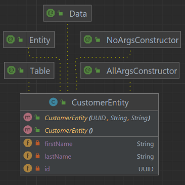
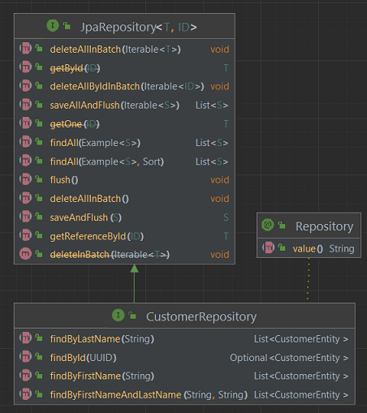
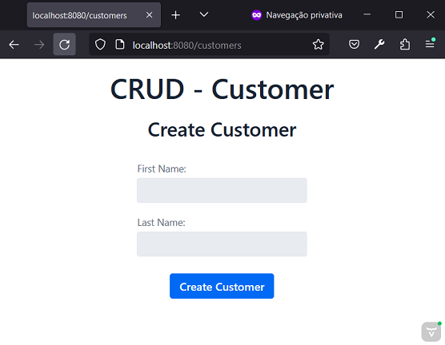
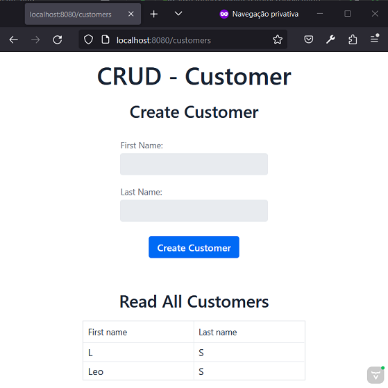

# Spring and Vaadin - Customer
Autor: Leonardo Simões


## Etapas do desenvolvimento
As etapas de desenvolvimento do projeto foram:

1. Criar projeto (no IntelliJ) com:
- Linguagem Java (17);
- Spring Framework (6.2.3);
- Dependências: Vaadin, JPA, H2, DevTools, Lombok.


2. Configurar o banco de dados H2:
- Em `build.gradle` configurar de acordo com o tipo de uso desejado:
    * `implementation 'com.h2database:h2'`;
    * `runtimeOnly 'com.h2database:h2'`;
    * `testImplementation 'com.h2database:h2'`;
- Em `application.properties`:

```properties
# ================================================================
#                   APPLICATION
# ================================================================
spring.application.name=Java-Spring-Vaadin-Customer
# ================================================================
#                   DATASOURCE - H2 DATABASE
# ================================================================
spring.datasource.url=jdbc:h2:mem:proddb
spring.datasource.driver-class-name=org.h2.Driver
spring.datasource.username=leo
spring.datasource.password=senha
spring.h2.console.enabled=true
spring.h2.console.path=/h2
```


- testar acesso ao console do H2 em `http://localhost:8080/h2/`:


Obs.:
- Por padrão, o usename seria "sa" e a senha "", e o console do h2 estaria desativado.

4. Criar classe `CustomerEntity`:
- no pacote `entities`;
- com atributos UUID id, String firstName, String lastName;
- correspondente a tabela de nome `CUSTOMERS`.



5. Criar interface `CustomerRepository`:
- no pacote `repositories`;
- anotada com `@Repository`;
- extends `JPARepository`;
- com métodos:
  * `Optional<CustomerEntity> findById(UUID id);`
  * `Optional<CustomerEntity> findById(UUID id);`
  * `List<CustomerEntity> findByFirstName(String firstName);`
  * `List<CustomerEntity> findByLastName(String lastName);`
  * `List<CustomerEntity> findByFirstNameAndLastName(String firstName, String lastName);`



6. Criar classe `MainView`:
- no pacote `views`;
- anotada com `@Route("customers")`;
- extends `VerticalLayout`;
- com um construtor anotado com `@Autowired` com um parâmetro (repository) e personalizar a tela dentro dele.






## Referências
Spring - Guides - Criando UI CRUD com Vaadin:
https://spring.io/guides/gs/crud-with-vaadin