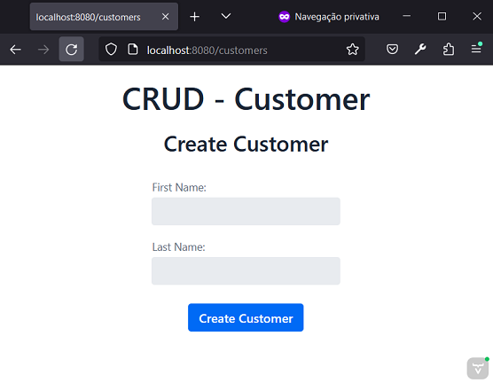

# Spring and Vaadin - Customer
Author: Leonardo Simões


## Development steps
The project development steps were:

1. Create project (in IntelliJ) with:
- Java language (17);
- Spring Framework (6.2.3);
- Dependencies: Vaadin, JPA, H2, DevTools, Lombok.


2. Configure the H2 database:
- In `build.gradle` configure according to the desired type of use:
* `implementation 'com.h2database:h2'`;
* `runtimeOnly 'com.h2database:h2'`;
* `testImplementation 'com.h2database:h2'`;
- In `application.properties`:

```properties
# ================================================================
#                   APPLICATION
# ================================================================
spring.application.name=Java-Spring-Vaadin-Customer
# ================================================================
#                   DATASOURCE - H2 DATABASE
# ================================================================
spring.datasource.url=jdbc:h2:mem:proddb
spring.datasource.driver-class-name=org.h2.Driver
spring.datasource.username=leo
spring.datasource.password=senha
spring.h2.console.enabled=true
spring.h2.console.path=/h2
```


- test access to the H2 console at `http://localhost:8080/h2/`:


Note:
- By default, the usename would be "sa" and the password "", and the h2 console would be disabled.

4. Create `CustomerEntity` class:
- in the `entities` package;
- with attributes UUID id, String firstName, String lastName;
- corresponding to the table named `CUSTOMERS`.


5. Create `CustomerRepository` interface:
- in the `repositories` package;
- annotated with `@Repository`;
- extends `JPARepository`;
- with methods:
    * `Optional<CustomerEntity> findById(UUID id);`
    * `Optional<CustomerEntity> findById(UUID id);`
    * `List<CustomerEntity> findByFirstName(String firstName);`
    * `List<CustomerEntity> findByLastName(String lastName);`
    * `List<CustomerEntity> findByFirstNameAndLastName(String firstName, String lastName);`


6. Create `MainView` class:
- in the `views` package;
- annotated with `@Route("customers")`;
- extends `VerticalLayout`;
- with a constructor annotated with `@Autowired` with a parameter (repository) and customize the screen inside it.




## References
Spring - Guides - Criando UI CRUD com Vaadin:
https://spring.io/guides/gs/crud-with-vaadin